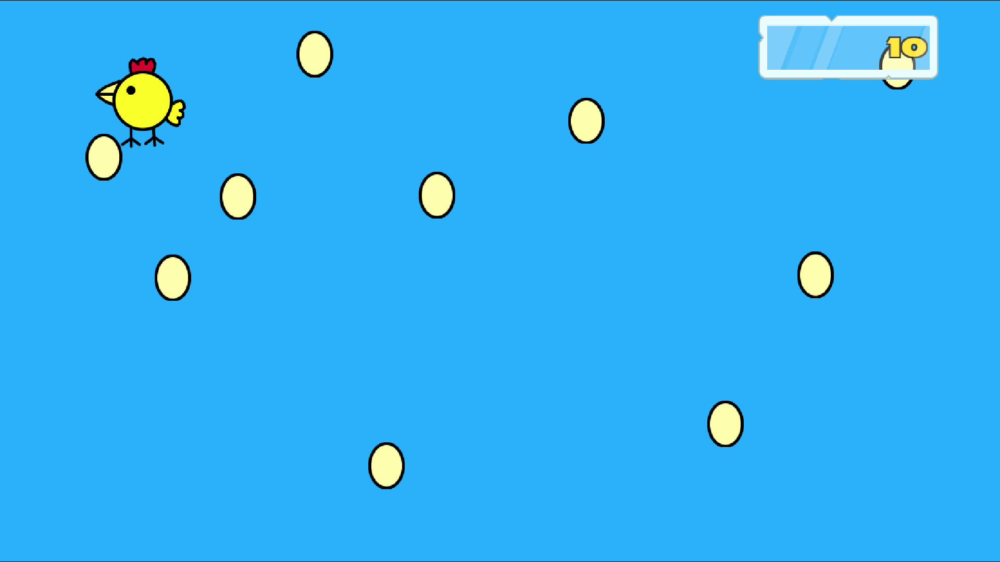

# Happy Mrs Chicken #

A simple "game" created for my Son. It bares some resemblance to one played by
Peppa Pig and her family.

-----
# Licence #

Code released under [GPL v2](LICENCE) .

-----
# Features #

  * Game with no ending
  * Supports touchscreen, mouse and keyboard (though less exciting)
  * Chicken moves around the screen
  * Clicking/Tapping the chicken causes it to lay and egg
  * The chicken laying an egg increases your score by one
  * Toggle cursor visibility by holding down the mouse button in the center of the game for about 1 second
  * Quit by holding down the mouse button in the center of the game for 3 seconds or more, or pressing _*ESC*_

-----
# Download #

At present, the v1.0.3 release is available as a `pck` (Godot package), as well
as platform specific bundles containing Godot v3.2.1 and the `pck` for Windows
(32/64 bit), Linux (32/64 bit) and MacOS (64 bit).

For Linux 64bit, a standalone, all in one, binary is also available (other
platforms coming soon including the Android as well as the above).

See the releases for links.

-----
# Future Features #

  * Actual functionality beyond the basics

----
##### vim:set ts=4 sw=4 tw=80 et cindent ai si syn=markdown: #####
